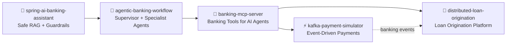

<div align="center">


# Hi, I'm Abhijit Narewade 👋😊

### Principal Engineer | Banking Technology Architect | Agentic AI Systems Engineer

[](https://git.io/typing-svg)

Thane, Maharashtra, India | Banking Technology | [LinkedIn](https://linkedin.com/in/abhijit-narewade)


</div>

---

## 😊 About Me

I am a Principal Engineer with 12+ years of experience building enterprise banking platforms across payments, lending, integration systems, and AI-assisted automation.

I enjoy turning complex banking problems into clean, observable, production-grade systems.

- 🏦 Banking domains: NEFT, RTGS, payments, lending, KYC, bureau, fraud, customer service
- ⚙️ Engineering: Java 21, Spring Boot, Kafka, PostgreSQL, Redis, Docker, Kubernetes
- 🤖 AI systems: MCP, LangGraph-style workflows, Spring AI, OpenAI, Anthropic, RAG
- 🧠 Architecture: Saga, CQRS, event sourcing, idempotency, auditability, guardrails
- 🎯 Focus: Principal/Staff Engineer and GCC architecture ready systems

<div align="center">

[](https://git.io/typing-svg)

</div>

---

## 🚀 Banking AI Architecture Suite

These repositories form a connected portfolio of modern banking architecture patterns: agentic AI, MCP tools, event-driven payments, loan origination, and safe RAG.



<div align="center">


</div>

---

## 🌟 Featured Projects

| Project | What It Shows | Stack |
|---|---|---|
| [🧠 agentic-banking-workflow](https://github.com/abhijitnarewade/agentic-banking-workflow) | Multi-agent banking automation with Supervisor, Customer Service, Loan Eligibility, Payment Status, Account Inquiry, and Fraud Analysis agents | LangGraph-style orchestration, MCP, FastAPI, memory, guardrails, HITL, OpenTelemetry |
| [🔌 banking-mcp-server](https://github.com/abhijitnarewade/banking-mcp-server) | Banking MCP server exposing account, payment, beneficiary, branch, and loan tools to AI agents | Java 21, Spring Boot, Spring AI MCP Server, REST, OpenAPI, Docker, Kubernetes |
| [🏦 distributed-loan-origination](https://github.com/abhijitnarewade/distributed-loan-origination) | Retail loan origination platform from application to disbursement | Spring Boot microservices, Kafka, PostgreSQL, Redis, Eureka, API Gateway, Saga, CQRS, event sourcing |
| [⚡ kafka-payment-simulator](https://github.com/abhijitnarewade/kafka-payment-simulator) | Enterprise NEFT/RTGS-style payment simulator with idempotency, retries, DLQ, and observability | Spring Boot, Kafka, Redis, PostgreSQL, OpenTelemetry, Prometheus, Grafana |
| [🤖 spring-ai-banking-assistant](https://github.com/abhijitnarewade/spring-ai-banking-assistant) | Safe RAG assistant for banking FAQs, policies, citations, audit logs, and streaming responses | Spring AI, OpenAI, Anthropic, PostgreSQL, pgvector, API key security |

<div align="center">

[](https://git.io/typing-svg)

</div>

---

## 🧩 Architecture Themes

<table>
  <tr>
    <td width="33%">
      <h3>🤖 Agentic Banking</h3>
      <ul>
        <li>Supervisor routing</li>
        <li>Specialist agents</li>
        <li>MCP tool integration</li>
        <li>Human approval gates</li>
        <li>Session-scoped memory</li>
      </ul>
    </td>
    <td width="33%">
      <h3>⚡ Event-Driven Systems</h3>
      <ul>
        <li>Kafka topic-per-stage</li>
        <li>Saga choreography</li>
        <li>Event sourcing</li>
        <li>CQRS projections</li>
        <li>Redis idempotency</li>
      </ul>
    </td>
    <td width="33%">
      <h3>🛡️ Responsible AI</h3>
      <ul>
        <li>RAG over approved docs</li>
        <li>Guardrails and refusals</li>
        <li>Prompt auditability</li>
        <li>Citations</li>
        <li>Provider routing</li>
      </ul>
    </td>
  </tr>
</table>

---

## 🛠️ Tech Stack

```text
Backend       Java 21, Spring Boot, Spring WebFlux, REST APIs, Maven
AI/Agents     MCP, LangGraph-style workflows, Spring AI, OpenAI, Anthropic, RAG
Messaging     Apache Kafka, Saga, CQRS, event sourcing, idempotency, DLQ
Data          PostgreSQL, pgvector, Redis, Oracle DB, DB2
Platform      Docker, Kubernetes, GitHub Actions, OpenTelemetry, Prometheus, Grafana
Banking       NEFT, RTGS, loan origination, KYC, bureau checks, fraud workflows
```

<div align="center">


</div>

---

## 🔄 Engineering Loop

<div align="center">

[](https://git.io/typing-svg)

</div>

---

## 🎯 Architecture Focus

These projects are designed to support Principal Engineer, Staff Engineer, and GCC architecture discussions around:

- 🧠 Designing regulated AI systems for banks
- 🔌 Exposing banking capabilities safely to LLM agents through MCP
- ⚡ Building Kafka-based payment and lending workflows
- 🏦 Applying Saga, CQRS, and event sourcing in real banking domains
- 🛡️ Adding observability, guardrails, auditability, and human-in-the-loop controls

---

## 🏆 Highlights

- 🏅 CEO's Supreme League Award, RBL Bank
- 🏅 Ripple Effect Award for Impact, RBL Bank
- 🏅 Special Recognition Award FY'23, RBL Bank
- ☁️ AWS Certified Cloud Practitioner

---

## 🤝 Connect

<div align="center">

[](https://linkedin.com/in/abhijit-narewade)
[](mailto:abhijitnarewade91@gmail.com)

### Thanks for visiting 😊


</div>
